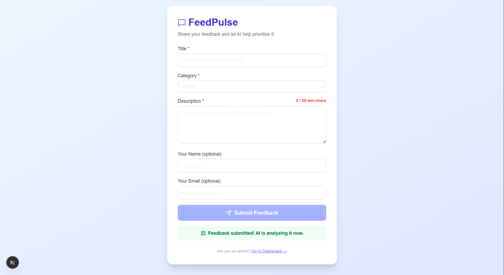
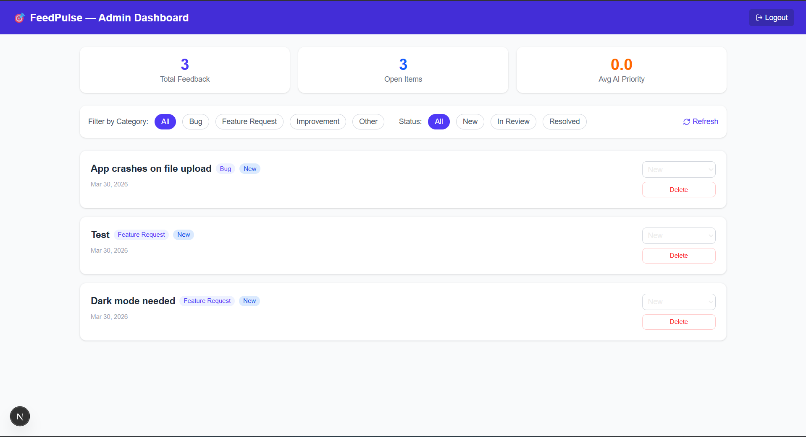

# FeedPulse — AI-Powered Product Feedback Platform

FeedPulse is a full-stack web application that lets teams collect product feedback and uses **Google Gemini AI** to automatically categorise, prioritise, and summarise submissions — giving product teams instant clarity on what to build next.

---

## Tech Stack

| Layer | Technology |
|-------|-----------|
| Frontend | Next.js 14+, TypeScript, Tailwind CSS |
| Backend | Node.js, Express, TypeScript |
| Database | MongoDB (local) + Mongoose |
| AI | Google Gemini 2.0 Flash |
| Auth | JWT (JSON Web Tokens) |

---

## Features

- **Public Feedback Form** — Anyone can submit feedback with title, description, category
- **AI Analysis** — Gemini automatically detects sentiment, priority score (1-10), summary, and tags
- **Admin Dashboard** — Protected login to view, filter, and manage all submissions
- **Status Management** — Update feedback from New → In Review → Resolved
- **Real-time Stats** — Total feedback, open items, average AI priority score

---

## How to Run Locally

### Prerequisites
- Node.js 18+
- MongoDB installed locally (running on port 27017)
- Google Gemini API key (free at aistudio.google.com)

### 1. Clone the repository
```bash
git clone https://github.com/kasunchamara-git/feedpulse.git
cd feedpulse
```

### 2. Setup the Backend
```bash
cd backend
npm install
```

Create a `.env` file in the `backend/` folder:
```
PORT=4000
MONGO_URI=mongodb://localhost:27017/feedpulse
GEMINI_API_KEY=your_gemini_api_key_here
JWT_SECRET=supersecret123
```

Start the backend:
```bash
npm run dev
```
You should see: `✅ Connected to MongoDB` and `🚀 Server running on http://localhost:4000`

### 3. Setup the Frontend
Open a second terminal:
```bash
cd frontend
npm install
npm run dev
```

### 4. Access the App
| Page | URL |
|------|-----|
| Feedback Form | http://localhost:3000 |
| Admin Login | http://localhost:3000/login |
| Admin Dashboard | http://localhost:3000/dashboard |

**Admin credentials:**
- Email: `admin@pulse.com`
- Password: `password123`

---

## Environment Variables

| Variable | Description |
|----------|-------------|
| `PORT` | Backend server port (default: 4000) |
| `MONGO_URI` | MongoDB connection string |
| `GEMINI_API_KEY` | Google Gemini API key |
| `JWT_SECRET` | Secret key for JWT tokens |

---

## Screenshots

### Feedback Submission Form


### Admin Dashboard


---

## API Endpoints

| Method | Endpoint | Description | Auth |
|--------|----------|-------------|------|
| POST | `/api/feedback` | Submit new feedback | Public |
| GET | `/api/feedback` | Get all feedback | Admin |
| PATCH | `/api/feedback/:id` | Update status | Admin |
| DELETE | `/api/feedback/:id` | Delete feedback | Admin |
| POST | `/api/auth/login` | Admin login | Public |

---

## How AI Works

When feedback is submitted:
1. It's saved to MongoDB immediately
2. Gemini AI analyses the title and description
3. Returns: `category`, `sentiment`, `priority_score` (1-10), `summary`, `tags`
4. These are saved back onto the feedback document
5. Visible as badges on the Admin Dashboard

---

## What I'd Build Next

- Email notifications when high-priority feedback is submitted
- Weekly AI digest report sent to admin
- Public voting on feature requests
- Webhook integrations (Slack, Jira)
- Docker support for one-command deployment

---

## Author

Built by [kasunchamara-git](https://github.com/kasunchamara-git)